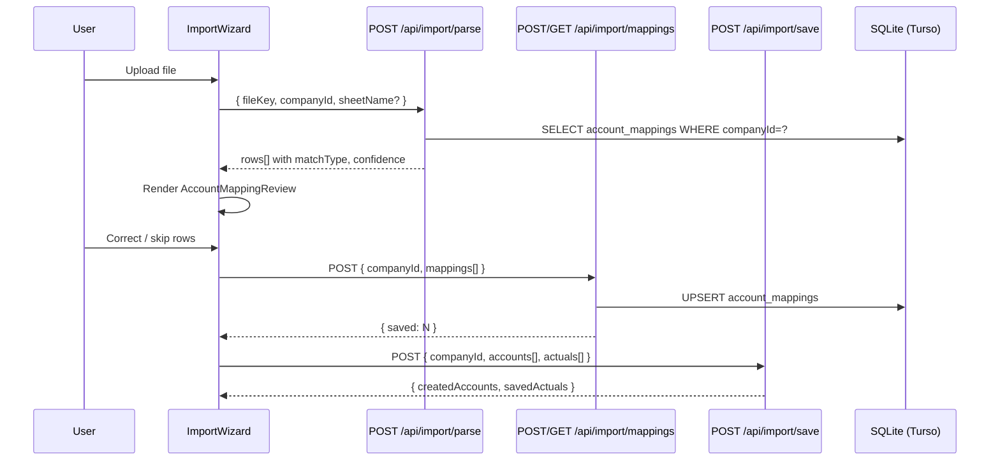

# Design Document: Account Mapping UI

## Overview

This feature adds a Human-in-the-Loop mapping layer between file upload and final import. After `POST /api/import/parse` returns, the frontend renders an `AccountMappingReview` component that lets users correct or skip any ledger names the auto-mapper couldn't confidently resolve. User decisions are persisted in a new `account_mappings` table and applied on every subsequent upload for that company, so the same ledger name is never mapped twice.

The design touches four layers:
1. **DB** — new `account_mappings` table in `src/lib/db/schema.ts`
2. **API** — new `GET/POST /api/import/mappings` route
3. **Preview pipeline** — `buildImportPreview` in `src/lib/server/imports.ts` gains a `companyId` parameter and applies saved mappings before the auto-mapper
4. **Frontend** — new `AccountMappingReview` component and Zustand slice

---

## Architecture



---

## Components and Interfaces

### New Files

| Path | Purpose |
|------|---------|
| `src/app/api/import/mappings/route.ts` | GET + POST handlers |
| `src/lib/db/queries/account-mappings.ts` | DB query helpers |
| `src/components/import/AccountMappingReview.tsx` | Main review table component |
| `src/components/import/CоaCombobox.tsx` | Searchable COA dropdown |
| `src/store/importMappingStore.ts` | Zustand slice for mapping state |

### Modified Files

| Path | Change |
|------|--------|
| `src/lib/db/schema.ts` | Add `accountMappings` table + relations |
| `src/lib/server/imports.ts` | `buildImportPreview` accepts optional `companyId` |
| `src/app/api/import/parse/route.ts` | Pass `companyId` to `buildImportPreview` |
| `src/lib/import/server-account-mapper.ts` | Export extended `MatchType` including `'saved' \| 'skipped'` |

---

## Data Models

### DB Schema — `account_mappings` table

Add to `src/lib/db/schema.ts`:

```typescript
export const accountMappings = sqliteTable(
  'account_mappings',
  {
    id: text('id').primaryKey().$defaultFn(() => crypto.randomUUID()),
    companyId: text('company_id')
      .notNull()
      .references(() => companies.id, { onDelete: 'cascade' }),
    rawLedgerName: text('raw_ledger_name').notNull(),
    standardAccountId: text('standard_account_id'), // null when skipped=true
    skipped: integer('skipped', { mode: 'boolean' }).notNull().default(false),
    createdAt: text('created_at').default(sql`(datetime('now'))`),
    updatedAt: text('updated_at').default(sql`(datetime('now'))`),
  },
  (table) => [
    uniqueIndex('idx_account_mappings_unique').on(table.companyId, table.rawLedgerName),
    index('idx_account_mappings_company').on(table.companyId),
  ]
)
```

Add to `companiesRelations`:
```typescript
accountMappings: many(accountMappings),
```

Add standalone relation:
```typescript
export const accountMappingsRelations = relations(accountMappings, ({ one }) => ({
  company: one(companies, {
    fields: [accountMappings.companyId],
    references: [companies.id],
  }),
}))
```

### Extended MatchType

In `src/lib/import/server-account-mapper.ts`, extend the exported type:

```typescript
export type ServerAccountMatchType =
  | 'exact'
  | 'alias'
  | 'keyword'
  | 'fuzzy'
  | 'unmapped'
  | 'saved'
  | 'skipped'
```

### API Request / Response Shapes

**POST /api/import/mappings**

Request body (validated with Zod):
```typescript
const mappingEntrySchema = z.object({
  rawLedgerName: z.string().min(1).max(500),
  standardAccountId: z.string().nullable(),
  skipped: z.boolean().default(false),
})

const postMappingsSchema = z.object({
  companyId: z.string().uuid(),
  mappings: z.array(mappingEntrySchema).min(1).max(500),
})
```

Success response `200`:
```typescript
{ saved: number }
```

Error responses: `400` (bad JSON), `403` (wrong company), `422` (invalid COA id or validation failure).

**GET /api/import/mappings**

Query params: `companyId` (required UUID).

Success response `200`:
```typescript
{
  mappings: Array<{
    rawLedgerName: string
    standardAccountId: string | null
    skipped: boolean
    updatedAt: string
  }>
}
```

### DB Query Helpers — `src/lib/db/queries/account-mappings.ts`

```typescript
// Returns a Map<rawLedgerName, { standardAccountId, skipped }> for fast lookup
export async function getMappingsForCompany(
  companyId: string
): Promise<Map<string, { standardAccountId: string | null; skipped: boolean }>>

// Upserts a batch of mappings; returns count of rows affected
export async function upsertMappings(
  companyId: string,
  entries: Array<{ rawLedgerName: string; standardAccountId: string | null; skipped: boolean }>
): Promise<number>
```

### Zustand Store — `src/store/importMappingStore.ts`

```typescript
interface RowOverride {
  standardAccountId: string | null
  skipped: boolean
}

interface ImportMappingState {
  // keyed by rawLedgerName
  overrides: Record<string, RowOverride>
  selectedRows: Set<string>

  setOverride: (rawLedgerName: string, override: RowOverride) => void
  setBulkOverride: (rawLedgerNames: string[], override: RowOverride) => void
  toggleRowSelection: (rawLedgerName: string) => void
  selectAll: (rawLedgerNames: string[]) => void
  clearSelection: () => void
  reset: () => void
}
```

---

## Data Flow

### 1. Upload → Parse

`POST /api/import/parse` already exists. Change: pass `companyId` to `buildImportPreview`.

```typescript
// src/app/api/import/parse/route.ts (modified)
const preview = await buildImportPreview(toArrayBuffer(file), body.sheetName, company.id)
```

### 2. Preview Pipeline — Saved Mappings Applied First

`buildImportPreview` in `src/lib/server/imports.ts` gains an optional third parameter:

```typescript
export async function buildImportPreview(
  buffer: ArrayBuffer,
  requestedSheetName?: string,
  companyId?: string,   // NEW
)
```

Inside the function, before the `.map()` over rows:

```typescript
// Load saved mappings once (empty map if no companyId)
const savedMappings = companyId
  ? await getMappingsForCompany(companyId)
  : new Map<string, { standardAccountId: string | null; skipped: boolean }>()
```

Inside the per-row `.map()`, replace the single `mapServerAccountDetailed(accountName)` call with:

```typescript
const saved = savedMappings.get(accountName)

let mapping: ServerAccountMappingResult

if (saved) {
  if (saved.skipped) {
    // Return a sentinel — filtered out below
    return { ...baseRow, matchType: 'skipped' as const, mappedAccountId: null, confidence: 1 }
  }
  const account = STANDARD_INDIAN_COA.find(a => a.id === saved.standardAccountId) ?? null
  mapping = { account, matchType: 'saved', confidence: 1.0 }
} else {
  mapping = mapServerAccountDetailed(accountName)
}
```

The existing `.filter()` at the end gains one more condition:

```typescript
.filter((row): row is PreviewRow => row !== null && row.matchType !== 'skipped')
```

This preserves full backward compatibility: when `companyId` is absent, `savedMappings` is an empty Map and every row falls through to `mapServerAccountDetailed` unchanged.

### 3. Mapping Review UI

After the parse response arrives, the import wizard renders `<AccountMappingReview>` before showing the "Import" button.

`AccountMappingReview` receives the full `rows[]` from the parse response and the `companyId`. It:
1. Computes `needsReview` rows: `matchType === 'unmapped' || confidence < 0.6`
2. Renders a table with a `CoaCombobox` per row
3. Tracks overrides in the Zustand store
4. Exposes `canProceed`: all `needsReview` rows have an override set

### 4. Save & Import

When the user clicks "Save & Import":

```typescript
// 1. Collect only rows that were user-modified
const mappingsPayload = Object.entries(overrides).map(([rawLedgerName, override]) => ({
  rawLedgerName,
  standardAccountId: override.standardAccountId,
  skipped: override.skipped,
}))

// 2. Persist mappings
await fetch('/api/import/mappings', {
  method: 'POST',
  body: JSON.stringify({ companyId, mappings: mappingsPayload }),
})

// 3. Build final accounts/actuals from merged rows (saved + auto-mapped, skipped excluded)
// 4. Call existing POST /api/import/save — schema unchanged
await fetch('/api/import/save', { method: 'POST', body: JSON.stringify(savePayload) })
```

---

## Frontend Component Architecture

### `AccountMappingReview`

```
AccountMappingReview
├── ReviewSummaryBanner          — "X rows need review"
├── BulkActionBar                — checkbox select-all + bulk assign dropdown
├── MappingTable (shadcn Table)
│   └── MappingRow (per row)
│       ├── RawNameCell          — raw ledger name, strikethrough if skipped
│       ├── MatchTypeBadge       — 'exact' | 'alias' | 'saved' | 'fuzzy' | 'unmapped'
│       ├── ConfidenceBar        — visual confidence indicator
│       └── CoaCombobox          — searchable grouped dropdown
└── ActionFooter
    ├── "Save & Import" button   — disabled until canProceed
    └── inline error display
```

### `CoaCombobox`

Uses shadcn `Popover` + `Command` (cmdk). Groups options by `category`. Filters against `name` and `aliases`. First item is always "Skip (exclude from forecast)" separated by a divider.

```typescript
interface CoaComboboxProps {
  value: string | null        // standardAccountId or null
  skipped: boolean
  onChange: (value: string | null, skipped: boolean) => void
  highlightNeeded: boolean    // amber ring when true
}
```

### `canProceed` logic (pure function, exported for testing)

```typescript
export function canProceed(
  rows: PreviewRow[],
  overrides: Record<string, RowOverride>
): boolean {
  const needsReview = rows.filter(
    r => r.matchType === 'unmapped' || r.confidence < 0.6
  )
  return needsReview.every(r => {
    const override = overrides[r.accountName]
    return override !== undefined && (override.skipped || override.standardAccountId !== null)
  })
}
```

### `needsReview` logic (pure function, exported for testing)

```typescript
export function needsReview(rows: PreviewRow[]): boolean {
  return rows.some(r => r.matchType === 'unmapped' || r.confidence < 0.6)
}
```

### `filterCoaOptions` logic (pure function, exported for testing)

```typescript
export function filterCoaOptions(
  query: string,
  accounts: StandardIndianAccount[]
): StandardIndianAccount[] {
  const q = query.toLowerCase()
  return accounts.filter(a =>
    a.name.toLowerCase().includes(q) ||
    a.aliases.some(alias => alias.toLowerCase().includes(q))
  )
}
```

---

## Correctness Properties

*A property is a characteristic or behavior that should hold true across all valid executions of a system — essentially, a formal statement about what the system should do. Properties serve as the bridge between human-readable specifications and machine-verifiable correctness guarantees.*

### Property 1: Upsert uniqueness invariant

*For any* `(companyId, rawLedgerName)` pair, after any number of upsert operations with different `standardAccountId` values, the `account_mappings` table SHALL contain exactly one row for that pair, holding the most recently submitted value.

**Validates: Requirements 1.2, 1.4**

### Property 2: Saved mapping round-trip

*For any* raw ledger name and standard account ID that are saved via `upsertMappings`, calling `getMappingsForCompany` for the same company SHALL return a map entry for that raw ledger name with the same `standardAccountId`.

**Validates: Requirements 1.1, 3.2**

### Property 3: Preview applies saved mappings

*For any* raw ledger name that has a saved mapping with a non-null `standardAccountId`, `buildImportPreview` called with the corresponding `companyId` SHALL return a row with `matchType === 'saved'` and `confidence === 1.0` for that ledger name.

**Validates: Requirements 3.1, 3.2**

### Property 4: Skipped rows excluded from preview

*For any* raw ledger name that has a saved mapping with `skipped: true`, `buildImportPreview` SHALL NOT include a row for that ledger name in the returned `rows` array.

**Validates: Requirements 3.3**

### Property 5: No saved mappings → identical to current behavior

*For any* file buffer and any company with zero saved mappings, `buildImportPreview(buffer, undefined, companyId)` SHALL produce a result identical to `buildImportPreview(buffer)` (no `companyId`).

**Validates: Requirements 3.5, 7.1**

### Property 6: Authorization invariant

*For any* `companyId` that does not belong to the authenticated user, both `GET /api/import/mappings` and `POST /api/import/mappings` SHALL return HTTP 403.

**Validates: Requirements 2.3, 2.4, 6.1**

### Property 7: Invalid COA ID rejected

*For any* `standardAccountId` string that is not present in `STANDARD_INDIAN_COA`, `POST /api/import/mappings` SHALL return HTTP 422.

**Validates: Requirements 2.5**

### Property 8: `canProceed` correctness

*For any* array of `PreviewRow` objects and any `overrides` map, `canProceed(rows, overrides)` SHALL return `true` if and only if every row where `matchType === 'unmapped'` or `confidence < 0.6` has a corresponding entry in `overrides` with either `skipped: true` or a non-null `standardAccountId`.

**Validates: Requirements 4.6**

### Property 9: `needsReview` correctness

*For any* array of `PreviewRow` objects where every row has `matchType` in `['exact', 'alias', 'saved']` and `confidence >= 0.6`, `needsReview(rows)` SHALL return `false`.

**Validates: Requirements 7.2**

### Property 10: COA filter completeness

*For any* search query string `q` and the full `STANDARD_INDIAN_COA` array, `filterCoaOptions(q, STANDARD_INDIAN_COA)` SHALL include every account whose `name` or any `alias` contains `q` (case-insensitive), and SHALL exclude every account whose `name` and all `aliases` do not contain `q`.

**Validates: Requirements 5.4**

---

## Error Handling

| Scenario | Handling |
|----------|---------|
| `POST /api/import/mappings` returns non-2xx | `AccountMappingReview` shows inline error banner; does NOT call `POST /api/import/save` |
| `POST /api/import/mappings` network timeout | Same as above; user can retry |
| Mappings API completely unavailable | Non-blocking warning toast; user may proceed with auto-mapped values only (Requirement 7.4) |
| `standardAccountId` not in COA | API returns 422 with message `"Unknown standardAccountId: <id>"` |
| Batch > 500 entries | API returns 422 with message `"mappings: too many items (max 500)"` |
| `companyId` mismatch | API returns 403 `"Unauthorized"` via `requireOwnedCompany` / `requireAccessibleCompany` |
| DB upsert failure | Wrapped in `handleRouteError`; returns 500 |

All API errors follow the existing `{ error: string }` shape from `handleRouteError`.

---

## Testing Strategy

**Unit tests** (Vitest):
- `canProceed` — specific examples covering all branch combinations
- `needsReview` — examples for all-good and mixed row sets
- `filterCoaOptions` — examples for exact name match, alias match, no match, empty query
- `upsertMappings` / `getMappingsForCompany` — in-memory SQLite via `better-sqlite3`
- `buildImportPreview` with mocked `getMappingsForCompany` — saved, skipped, and fallthrough cases

**Property-based tests** (fast-check, minimum 100 iterations each):
- Property 1: Upsert uniqueness invariant
- Property 2: Saved mapping round-trip
- Property 3: Preview applies saved mappings
- Property 4: Skipped rows excluded from preview
- Property 5: No saved mappings → identical behavior
- Property 6: Authorization invariant (mocked auth)
- Property 7: Invalid COA ID rejected
- Property 8: `canProceed` correctness
- Property 9: `needsReview` correctness
- Property 10: COA filter completeness

Tag format for each property test:
```
// Feature: account-mapping-ui, Property N: <property_text>
```

**Integration tests** (Playwright or API-level):
- Full upload → parse → mapping review → save flow with a real SQLite test DB
- Verify saved mappings are applied on second upload of same file

---

## Migration SQL

```sql
-- Migration: add account_mappings table
-- File: drizzle/migrations/XXXX_add_account_mappings.sql

CREATE TABLE IF NOT EXISTS account_mappings (
  id                 TEXT PRIMARY KEY NOT NULL,
  company_id         TEXT NOT NULL REFERENCES companies(id) ON DELETE CASCADE,
  raw_ledger_name    TEXT NOT NULL,
  standard_account_id TEXT,           -- NULL when skipped = 1
  skipped            INTEGER NOT NULL DEFAULT 0 CHECK (skipped IN (0, 1)),
  created_at         TEXT DEFAULT (datetime('now')),
  updated_at         TEXT DEFAULT (datetime('now'))
);

CREATE UNIQUE INDEX IF NOT EXISTS idx_account_mappings_unique
  ON account_mappings (company_id, raw_ledger_name);

CREATE INDEX IF NOT EXISTS idx_account_mappings_company
  ON account_mappings (company_id);
```

The Drizzle migration file should be generated via:
```
npx drizzle-kit generate
```
and applied via:
```
npx drizzle-kit migrate
```
